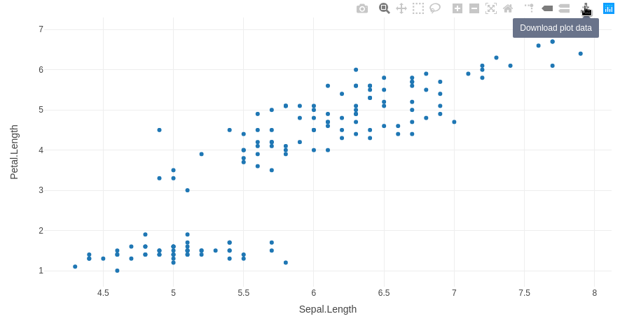
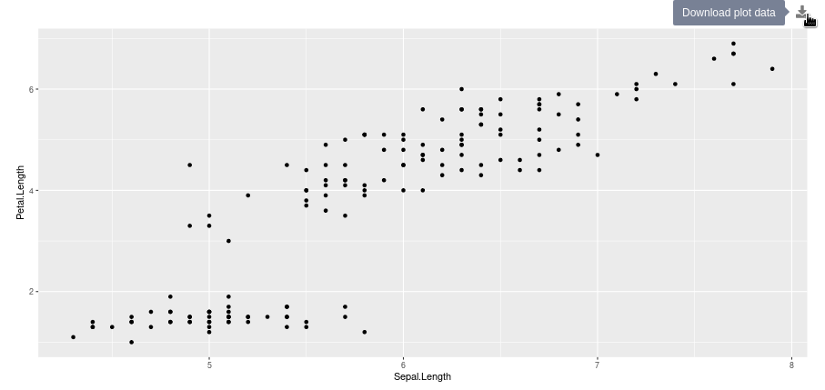

# shinydlplot


### Installation

```R
remotes::install_github('hms-dbmi/shinydlplot)
```

### Usage

Example that renders a `plotly` with a download button to download the iris dataset:

```R
library(shiny)
library(shinyjs)
library(shinydlplot)
library(plotly)

ui <- fluidPage(
  useShinyjs(),
  downloadablePlotlyUI(id = 'iris')
)

server <- function(input, output, session) {
  
  plot <- plot_ly(data = iris, x = ~Sepal.Length, y = ~Petal.Length)
  
  callModule(downloadablePlotly, 
             id = 'iris', 
             plot = plot, 
             filename = 'iris.csv', 
             content = function(file) {write.csv(iris, file)})
}

shinyApp(ui, server)
```



Example that renders a `ggplot2` object with a download button to download the iris dataset:

```R
library(shiny)
library(shinyjs)
library(shinydlplot)
library(ggplot2)

ui <- fluidPage(
  useShinyjs(),
  downloadablePlotUI(id = 'iris_plot')
)

server <- function(input, output, session) {

  plot <- ggplot(iris, aes(x = Sepal.Length, y = Petal.Length)) + geom_point()

  callModule(downloadablePlot,
             id = 'iris_plot',
             plot = plot,
             filename = 'iris.csv',
             content = function(file) {write.csv(iris, file)})
}

shinyApp(ui, server)
```


